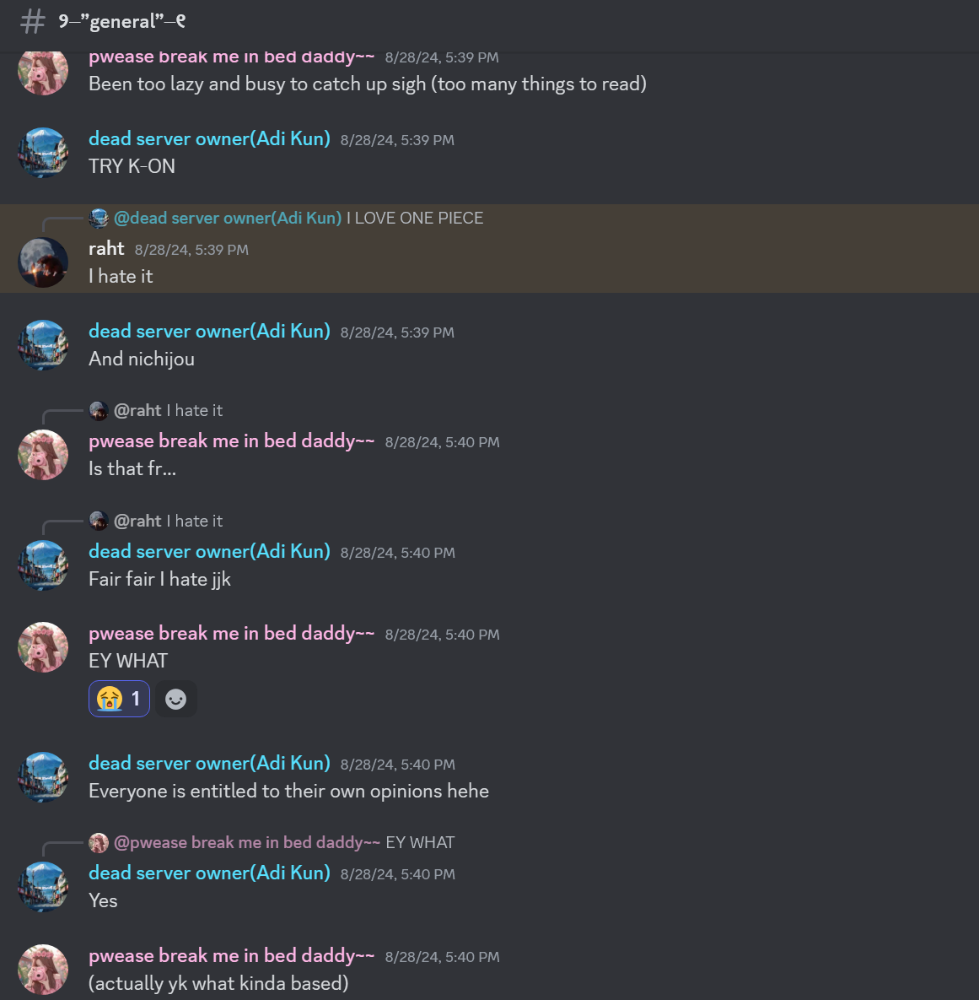
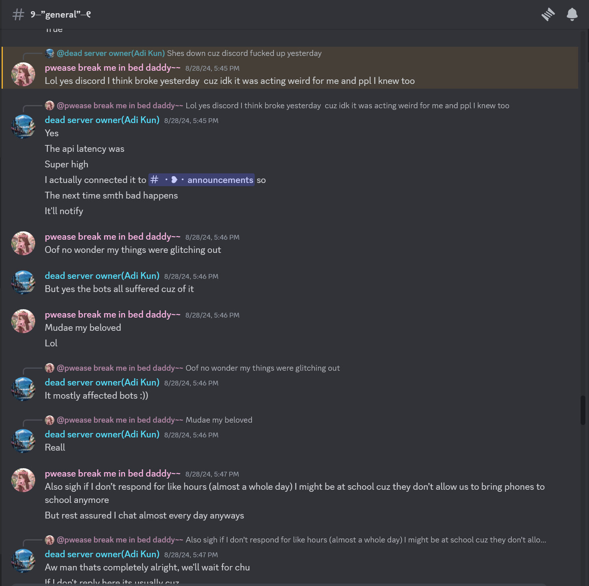

<html>
<head>
<link
  rel="stylesheet"
  href="https://cdn.jsdelivr.net/npm/bulma@1.0.2/css/bulma.min.css"
>

</head>

<body bgcolor = "#923cdf">
 
 

	

	

	  

		<figure class="image">
		  
		</figure>
	  

	  

		

		  

			  
		  

		  

			
An Angel joins the server~

			
@typedecker

		  

		

		

			

			  On the very auspicious day of 28th August, 2024~ The cutest sweetheart joined my server 🧡. When you joined, Angela, it was almost as if a switch was flipped in my life. My life that had been a constant cycle of gaining and losing friends,
			  had finally turned into more than just that. Thanks for giving my life a meaning. You mean the world to me.
			

		   
		   
		  

		  

		  <time datetime="2024-08-28">5:14 PM - 28th August 2024</time>
		  

		

	  

	

	

	
	

	

	  

		<figure class="image">
		  
		</figure>
	  

	  

		

		  

			  
		  

		  

			
She: Her likes, dislikes, and her original cute intro 🧡

			
@typedecker

		  

		

		

		  

			Never knew a small piece of text, describing the likes and dislikes of a person, would be something I'd have memorized in my head. Never thought I'd wanna know everything a person likes.
			Never thought anyone would agree with the things I am into, and be with me through thick and thin, always appreciating every lil bit of my effort. You.. Angela, are a fucking angel. Just
			like your name suggests and, I am happy to have met this angel in my life 🧡💜.
		  

		  

		  

		  <time datetime="2024-08-28">5:25 PM - 28th August 2024</time>
		  

		

	  

	

	

	
	

	

	  

		<figure class="image">
		  
		</figure>
	  

	  

		

		  

			  
		  

		  

			
Our First Ever Conversation: Ngl, you found me, and I, found you🧡

			
@typedecker

		  

		

		

		  

			I love how we clicked right in, almost as if, we were both puzzle pieces, with life being the incomplete puzzle we set out to solve.
			In you, I found that one missing element I needed to complete myself. An everlasting partner. A trustworthy soulmate. A lovely companion.
			and.. most importantly... An angelic kind softhearted cute amazing soul. Ahaha fine. fine. i wont turn this into the japanese jugemo name meme! But ilysm I think you get it by now!
		  

		  

		  

		  <time datetime="2024-08-28">5:25 PM - 28th August 2024</time>
		  

		

	  

	

	

	
	

	

	  

		<figure class="image">
		  
		</figure>
	  

	  

		

		  

			  
		  

		  

			
An Angel joins the server~

			
@typedecker

		  

		

		

		  poo~
		  

		  

		  <time datetime="2016-1-1">11:09 PM - 1 Jan 2016</time>
		  

		

	  

	

	

	
	

	

	  

		<figure class="image">
		  
		</figure>
	  

	  

		

		  

			  
		  

		  

			
An Angel joins the server~

			
@typedecker

		  

		

		

		  poo~
		  

		  

		  <time datetime="2016-1-1">11:09 PM - 1 Jan 2016</time>
		  

		

	  

	

	

 
 
</body>
</html>
